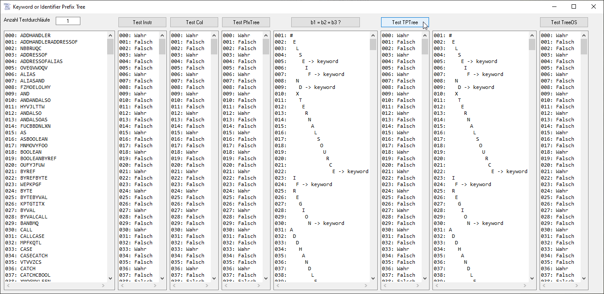

# Langg_KeywOrIdefixTree  
## Keyword Or Identifier Prefix Tree  

  
  
  
  

A PrefixTree will be used by a parser especially the tokenizer of a programming language to distinguish between keywords and identifiers.  
The idea to this project started in dec.2009, but the implementation was not that great. The concrete solution as it is now came to life in 2019 when idiv and Olaf Schmidt contributed their knowledge.

  

